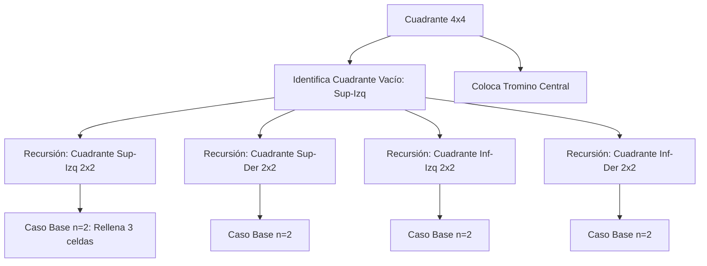

### Documentación del Programa de Azulejado con Trominos

#### Descripción
Este programa resuelve el problema de **azulejado con trominos** utilizando un enfoque recursivo de divide y vencerás. El objetivo es cubrir una cuadrícula de tamaño `2^n x 2^n` con piezas en forma de "L" (trominos), dejando exactamente un hueco vacío. La solución incluye:
- Implementación del algoritmo recursivo
- Generación de cuadrículas con huecos aleatorios
- Visualización gráfica de los resultados

---

#### Requisitos
- Python 3.x
- Bibliotecas:
  ```
  pip install numpy matplotlib
  ```

---

#### Uso
Ejecute desde la terminal:
```
python3 main.py <exponente>
```
- **`<exponente>`**: Entero ≥ 1 que define el tamaño de la cuadrícula (`tamaño = 2^exponente`)

**Ejemplo** para una cuadrícula 8x8:
```
python3 main.py 3
```

---

#### Explicación del Algoritmo
1. **Inicialización**:
   - Crea una cuadrícula `2^n x 2^n` inicializada con ceros.
   - Selecciona aleatoriamente una celda vacía (marcada con `-1`).

2. **Función Principal `azulejar_cuadricula`**:
   - **Caso Base**: Si `n = 2`, cubre directamente las 3 celdas restantes.
   - **Paso Recursivo**:
     1. Divide la cuadrícula en 4 cuadrantes de tamaño `n/2`.
     2. Identifica el cuadrante que contiene la celda vacía.
     3. Coloca un tromino central que cubre una celda en cada uno de los otros 3 cuadrantes.
     4. Llama recursivamente a la función para los 4 cuadrantes.

3. **Colocación de Trominos**:
   ```python
   # Ejemplo para cuadrante superior-izquierdo ocupado
   colocar_azulejos(
       x + mitad, y + mitad - 1,  # Cuadrante inf-izq
       x + mitad, y + mitad,       # Cuadrante inf-der
       x + mitad - 1, y + mitad,   # Cuadrante sup-der
       contador, cuadricula
   )
   ```

---

#### Demostración Recursiva (n=4)


---

#### Visualización
El resultado se muestra con `matplotlib`:
- Cada tromino tiene un color único.
- La celda vacía se marca con una `X`.
- Ejemplo para 8x8:


---

#### Estructura del Código
| Función                     | Descripción |
|-----------------------------|-------------|
| `colocar_azulejos()`        | Asigna 3 celdas al mismo tromino |
| `azulejar_cuadricula()`     | Función recursiva principal |
| `main()`                    | Maneja entrada, inicializa cuadrícula y visualización |

---

#### Notas
- **Complejidad**: $O(n^2)$, donde $n$ es el tamaño de la cuadrícula.
- **Validación**: El exponente debe ser $\geq 1$