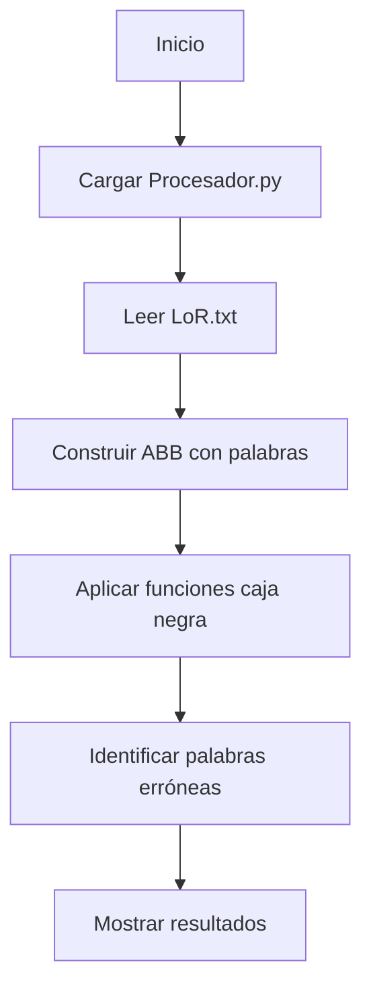

## Programa de Detección de Errores en Texto con Árbol Binario y Caja Negra

### Descripción
Este programa identifica palabras potencialmente erróneas en textos utilizando:
1. **Árbol binario de búsqueda (ABB)** para almacenar palabras
2. **Módulo externo (caja negra)** con funciones de procesamiento desconocidas
3. **Procesamiento léxico** para análisis de texto

---

### Requisitos
- Python 3.x
- Archivos en el mismo directorio:
  - `main.py` (programa principal)
  - `Procesador.py` (funciones de procesamiento)
  - `LoR.txt` (texto a analizar)

---

### Uso
1. Colocar los 3 archivos en el mismo directorio
2. Ejecutar:
```bash
python main.py
```

---

### Flujo del Programa


---

### Componentes Clave

#### 1. Estructuras de Datos
| Clase               | Función |
|---------------------|---------|
| `Nodo`              | Almacena palabras y enlaces para ABB |
| `ArbolBinarioBusqueda` | Implementa inserción y búsqueda en ABB |

#### 2. Funciones Principales
| Función | Descripción |
|---------|-------------|
| `cargar_funciones_desde_archivo()` | Importa dinámicamente `Procesador.py` |
| `construir_arbol()` | Crea ABB a partir de palabras del texto |
| `buscar_errores()` | Aplica funciones de caja negra a cada palabra |

---

### Mecanismo de Detección
1. **Preprocesamiento**:
   - Convertir texto a minúsculas
   - Extraer palabras con `\b\w+\b`
   - Ejemplo: `"¡Hola Mundo!" → ["hola", "mundo"]`

2. **Caja Negra (`Procesador.py`)**:
```python
# Interfaz requerida (implementación desconocida)
def procesado1(palabra: str) -> bool: ...
def procesado2(palabra: str) -> bool: ...
def procesado3(palabra: str) -> bool: ...
```

3. **Detección de errores**:
   - Palabra se marca como error si CUALQUIER función retorna `True`
   - Reporte final sin duplicados (`set(errores)`)

---

### Salida Esperada
```
Errores encontrados:
- La palabra 'mellon' es un error.
- La palabra 'khazaddûm' es un error.
- La palabra 'palantír' es un error.
```

---

### Limitaciones y Consideraciones
1. **Dependencia crítica**:
   - `Procesador.py` debe contener exactamente 3 funciones con nombres específicos
   - El archivo `LoR.txt` debe existir en el mismo directorio

2. **Árbol binario no utilizado**:
   - El ABB se construye pero no se usa en la detección
   - Posible uso futuro: validar contra diccionario

3. **Tokenización básica**:
   - No maneja contracciones ("can't") ni palabras compuestas


---

### Notas Técnicas
- **Complejidad**: 
  - Inserción en ABB: O(n log n) promedio
  - Detección de errores: O(p × f) (p: palabras únicas, f: funciones)
- **Recursividad**: Implementada en métodos del ABB (`_insertar_recursivo`, `_buscar_recursivo`)

---

Este programa funciona como un **sistema de validación léxica modular** donde la lógica de detección de errores está completamente encapsulada en el módulo externo `Procesador.py`, manteniendo un acoplamiento mínimo mediante una interfaz bien definida.