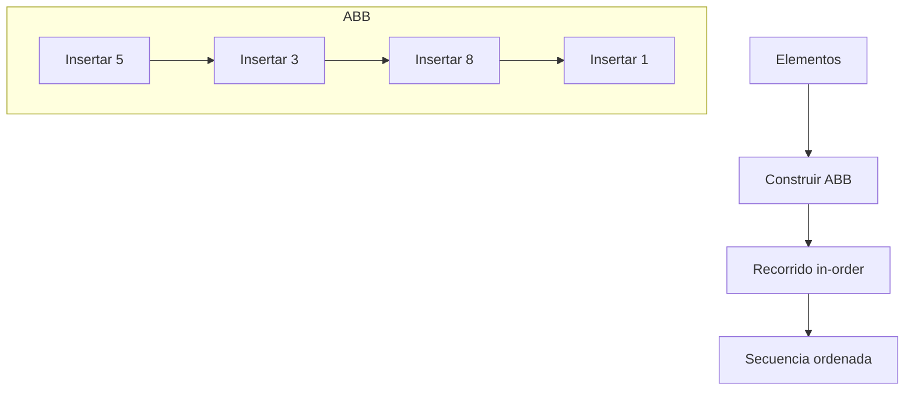
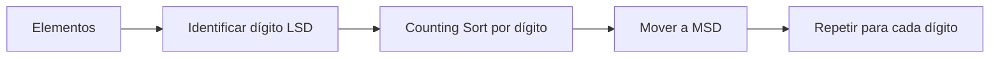

## Programa de Visualización de Algoritmos de Ordenamiento

### Descripción
Este programa implementa y visualiza tres algoritmos de ordenamiento con detalle paso a paso:
1. **Inserción Local** (Local Insertion Sort)
2. **Ordenamiento de Árbol** (Tree Sort)
3. **Radix LSD Sort** (para valores hexadecimales)

Muestra cada operación intermedia durante el proceso de ordenamiento, permitiendo observar cómo los algoritmos transforman los datos.

---

### Requisitos
- Python 3.x

---

### Uso
```bash
python Ordenamiento.py
```
Siga las instrucciones interactivas:
1. Seleccione algoritmo (1-3)
2. Ingrese datos según el algoritmo:
   - **Algoritmos 1-2**: Enteros separados por espacios (ej: `5 3 8 1`)
   - **Algoritmo 3**: Valores hexadecimales de hasta 2 dígitos (ej: `A3 1F 2B`)
3. Analice los pasos detallados
4. Repita con otra secuencia (s/n)

---

### Algoritmos Implementados

#### 1. Inserción Local (`ordenamiento_insercion`)

- **Complejidad**: O(n²)
- **Visualización**: Muestra cada movimiento e inserción

#### 2. Ordenamiento de Árbol (`ordenar_arbol`)

- **Complejidad**: O(n log n) promedio
- **Visualización**: Registra cada inserción y visita durante el recorrido

#### 3. Radix LSD Sort (`ordenamiento_radix_lsd`)

- **Complejidad**: O(n * k) (k = longitud máxima)
- **Visualización**: Muestra conteo, acumulación y ordenamiento por cada dígito

---

### Componentes del Código
| Función | Descripción |
|---------|-------------|
| `NodoArbol` | Nodo para árbol binario |
| `insertar` | Inserta en ABB y registra pasos |
| `recorrido_en_orden` | Recorrido in-order con registro |
| `ordenar_arbol` | Implementa Tree Sort |
| `ordenamiento_insercion` | Implementa Inserción Local |
| `ordenamiento_cuenta` | Counting Sort para Radix |
| `ordenamiento_radix_lsd` | Implementa Radix LSD |
| `imprimir_pasos` | Muestra pasos enumerados |
| `main` | Interfaz de usuario principal |

---

### Ejemplos de Salida

### Inserción Local (entrada: `5 3 8 1`)


#### Tree Sort (entrada: `5 3 8 1`)


#### Radix LSD (entrada: `A3 1F 2B`)


 
---

### Características Clave
1. **Visualización detallada**:
   - Cada operación se registra y numera
   - Explicaciones claras de cada paso
   - Estado actual del arreglo en puntos clave

2. **Validación de entradas**:
   - Verificación de hexadecimales en Radix Sort
   - Manejo de errores en selección de algoritmo

3. **Interfaz interactiva**:
   - Menú intuitivo
   - Posibilidad de múltiples ejecuciones
   - Mensajes de error descriptivos

---

### Limitaciones
1. **Radix LSD**:
   - Solo acepta valores hexadecimales (0-9, A-F)
   - Longitud máxima de 2 caracteres
   - No soporta minúsculas (usar mayúsculas)

2. **Tree Sort**:
   - Implementación con árbol no balanceado
   - Rendimiento degradado con secuencias ordenadas

3. **Tipos de datos**:
   - Inserción y Tree Sort solo para enteros
   - Radix solo para cadenas hexadecimales


---

### Conclusión
Este programa ofrece una herramienta para comprender el funcionamiento interno de tres algoritmos de ordenamiento fundamentales mediante la visualización detallada de cada paso del proceso. Su diseño sencillo y explicaciones claras lo hacen ideal para fines didácticos y de aprendizaje.