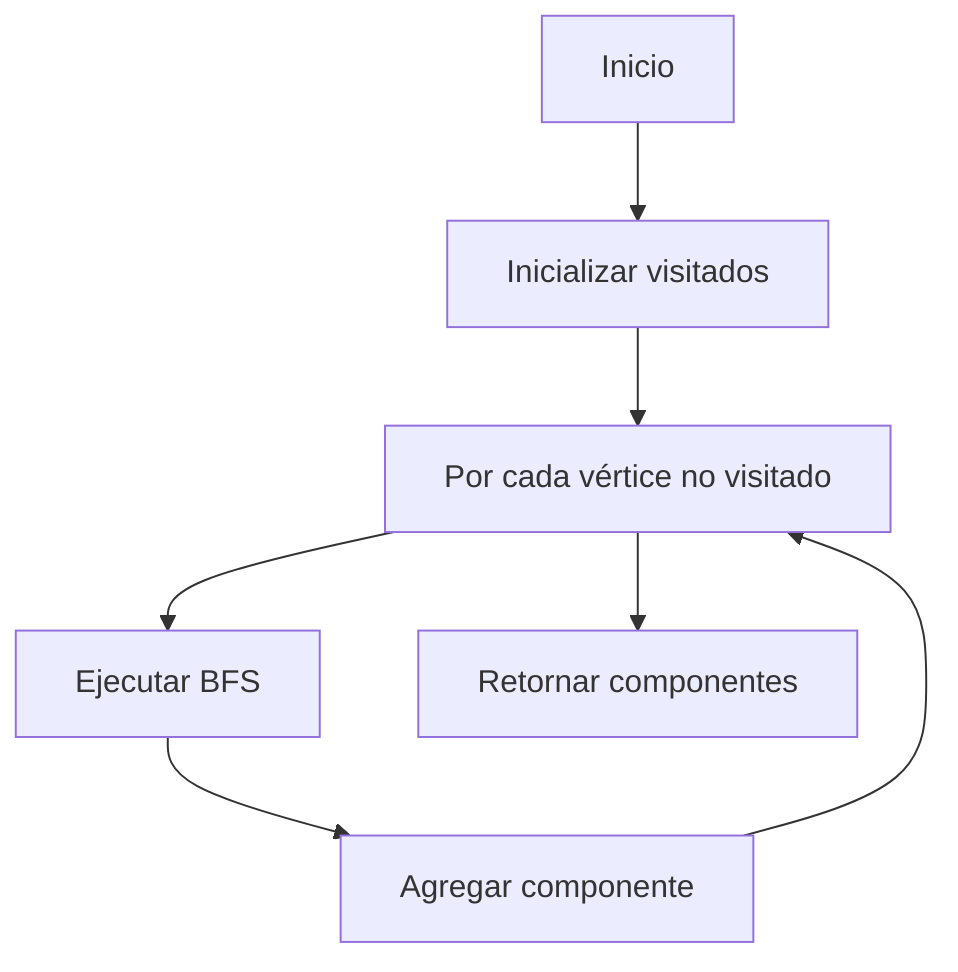
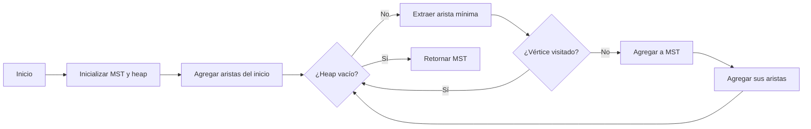

# Algoritmo de Prim para Bosques de Expansión Mínima

## Descripción
Este programa implementa el **algoritmo de Prim** para encontrar árboles de expansión mínima (MST) en cada componente conexa de un grafo no dirigido y ponderado. Cuando el grafo es disconexo, genera un **bosque de expansión mínima** (colección de MSTs para cada componente conexa).

---

## Características Clave
- Encuentra MSTs para cada componente conexa
- Implementación eficiente con **min-heap**
- Búsqueda en amplitud (BFS) para componentes conexas
- Manejo de grafos grandes mediante entrada por archivo

---

## Requisitos
- Python 3.x
- Bibliotecas estándar (no se requieren instalaciones adicionales)

---

## Uso
```bash
python prim.py <archivo_de_entrada>
```

### Formato del Archivo de Entrada
1. **Primera línea**: Vértices separados por comas  
   Ejemplo: `A,B,C,D,E`
2. **Líneas siguientes**: Aristas con formato `u,v : peso`  
   Ejemplo: `A,B : 5`

### Archivo de Ejemplo (`test.txt`)

```
A,B,C,D,E,F
A,B : 4
A,C : 2
B,C : 1
B,D : 5
C,D : 8
C,E : 10
D,E : 2
F,G : 3
```

### Ejecución
```bash
python3 prim.py test.txt
```

### Salida Esperada

---

## Estructura del Código

### Clases Principales
| Clase | Descripción |
|-------|-------------|
| `Arista` | Representa una arista con vértices `u`, `v` y peso |
| `Grafo` | Almacena vértices y aristas con métodos de manipulación |

### Funciones Clave
| Función | Descripción |
|---------|-------------|
| `prim(grafo, inicio)` | Implementa algoritmo de Prim para MST |
| `encontrar_componentes(grafo)` | Detecta componentes conexas con BFS |
| `main(file_path)` | Función principal de ejecución |

---

## Algoritmos Implementados

### 1. Detección de Componentes Conexas (BFS)


### 2. Algoritmo de Prim


---


## Limitaciones
1. **Pesos**: Solo acepta valores enteros positivos
2. **Formato**: Estricto cumplimiento del formato de entrada
3. **Vértices**: Nombres deben ser únicos y sin comas
4. **Eficiencia**: Adecuado para grafos medianos (no optimizado para grafos muy grandes)


---

## Teoría Subyacente
### Bosque de Expansión Mínima
- **Definición**: Para un grafo disconexo G, es el conjunto de árboles de expansión mínima de cada componente conexa de G
- **Aplicaciones**:
  - Diseño de redes de bajo costo
  - Análisis de clusters
  - Sistemas de distribución eléctrica

### Complejidad
| Algoritmo | Complejidad |
|-----------|-------------|
| Detección de componentes | O(V + E) |
| Algoritmo de Prim | O(E log V) por componente |